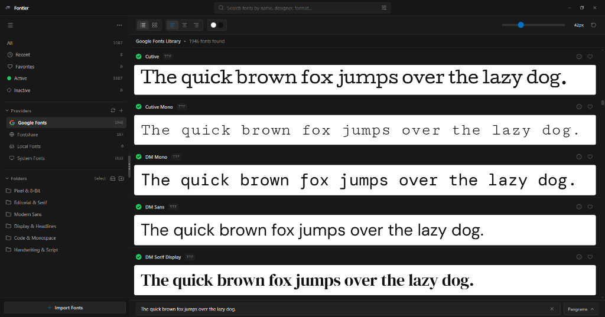
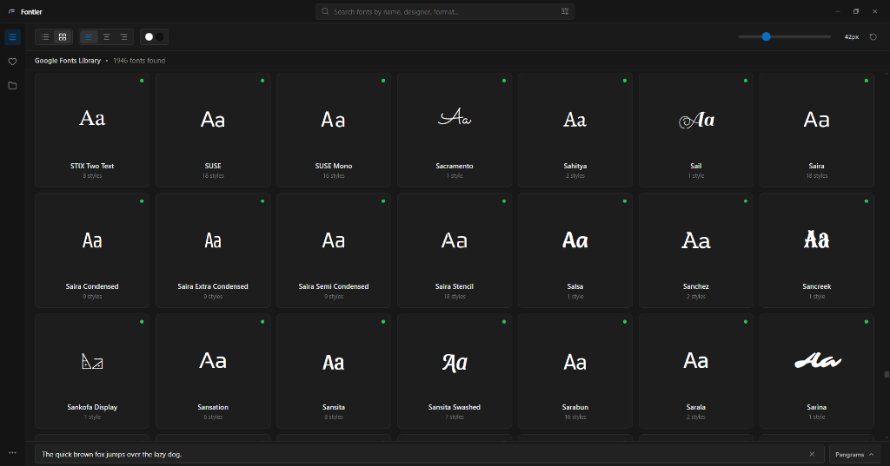
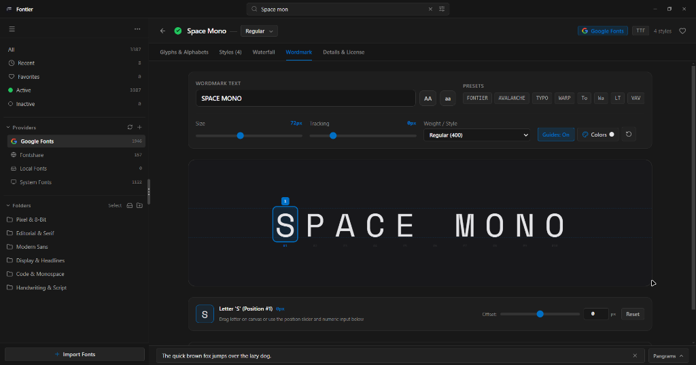
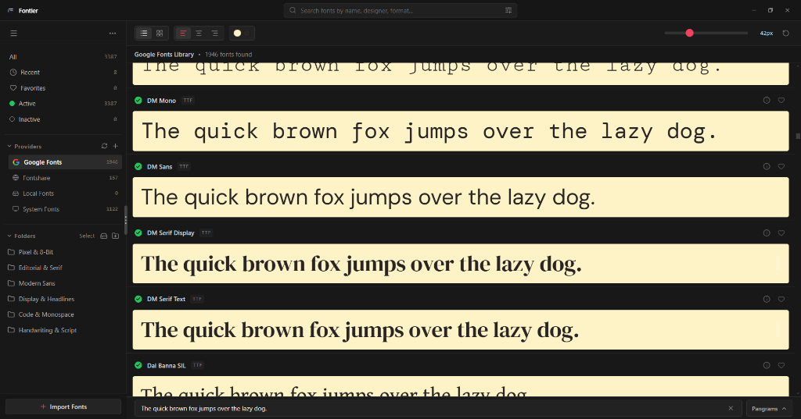

# Fontier 

> **Modern Desktop Font Manager & Typography Studio.**  
> A lightning-fast, open-source desktop font organizer, viewer, and kerning studio.

<div align="center">

[](https://github.com/kubichi/fontier/releases/latest)
[](https://github.com/kubichi/fontier/releases/latest)
[](https://github.com/kubichi/fontier/releases/latest)

[](https://github.com/kubichi/fontier/releases/latest)
[](LICENSE)

</div>

---

## Showcase

<p align="center">
  
</p>

<p align="center">
  
</p>

<p align="center">
  
</p>

<p align="center">
  
</p>

---

## Key Features

- **Blazing-Fast Virtualized Rendering & Memory Management**
  - High-performance virtual windowed rendering renders only visible fonts in the viewport.
  - Integrated LRU FontFace memory cache prevents browser memory bloat when scrolling through thousands of fonts.
- **Built-in Open-Source Type Providers & Catalogs**
  - **Google Fonts**: Instant access to 1,940+ curated typefaces with lazy-loaded webfont previews.
  - **Fontshare**: Curated modern typography from the Indian Type Foundry (ITF).
  - **UNCUT**: Contemporary libre typography catalog (including *Saint*, *Uncut Sans*, *Geist Mono*, etc.).
  - **Velvetyne, Collletttivo, Free Faces & Open Foundry**: Direct integration with leading open-source type foundries.
  - **Local & System Fonts**: Seamless native scanning of installed Windows/macOS/Linux system fonts.
- **Wordmark Studio & Kerning Laboratory**
  - Interactive letter-by-letter kerning with fine-grained position sliders and numeric inputs.
  - Multi-letter distance measurement and visual guide overlays.
  - Full keyboard shortcuts (Arrow keys for step kerning, Shift + Arrow for 5px increments).
  - Global tracking adjustments and quick logo/word presets.
  - Copy SVG or PNG paths directly to clipboard for Figma/Illustrator workflows.
- **Hierarchical Subfolder Tree & Library Organization**
  - Mirror exact directory structures on import (e.g., `fonts/editorial/serif/...`).
  - Expand/collapse folders with persistent state and custom folder colors.
  - **Resizable Navigation Panel ("Scaler")**: Drag to adjust the sidebar width from **180px up to 800px** with double-click auto-reset.
- **Multi-Select & Bulk Management**
  - **Selection Mode**: Bulk check and manage folders with recursive child toggling.
  - **Safe Remove**: Hide folders from the library while keeping local hard drive files 100% untouched.
  - **OS Trash / Recycle Bin**: Safely move unwanted folders directly to the OS Recycle Bin with confirmation.
- **Real-Time Canvas Customization**
  - Live preview text customization with built-in pangram presets.
  - Dual canvas color picker with custom text and background styling (Classic, Dark, Monokai, Nordic Slate, OLED Black, etc.).
  - Adjustable font size, alignment, and row density (comfortable / compact).
- **Deep Typeface Inspector & Glyph Viewer**
  - Interactive glyph tables, Unicode code points, categories, and character sets.
  - Full OpenType metadata: designer info, postscript names, units per em, licensing, and file path.

---

## Getting Started

### Prerequisites

- [Node.js](https://nodejs.org/) (v18 or newer recommended)
- [npm](https://www.npmjs.com/) or [yarn](https://yarnpkg.com/)

### Installation

```bash
# Clone repository
git clone https://github.com/kubichi/fontier.git
cd fontier

# Install dependencies
npm install
```

### Running Locally in Development

```bash
# Start Vite development server & Electron application
npm run electron:dev
```

### Building for Production

```bash
# Build frontend web assets
npm run build

# Package standalone desktop executable and installer
npm run electron:build
```

The output binaries will be created in the `release/` directory:
- `release/win-unpacked/Fontier.exe` (Standalone portable executable)
- `release/Fontier Setup 1.2.1.exe` (Windows NSIS installer)

---

## Technology Stack

- **Runtime**: [Electron](https://www.electronjs.org/)
- **UI Framework**: [React 19](https://react.dev/) + [TypeScript](https://www.typescriptlang.org/)
- **Bundler**: [Vite](https://vitejs.dev/)
- **Styling**: [Tailwind CSS](https://tailwindcss.com/)
- **Font Parsing**: [opentype.js](https://opentype.js.org/)
- **Icons**: [Lucide React](https://lucide.dev/)

---

## License

Licensed under the MIT License. Feel free to use, modify, and distribute.
